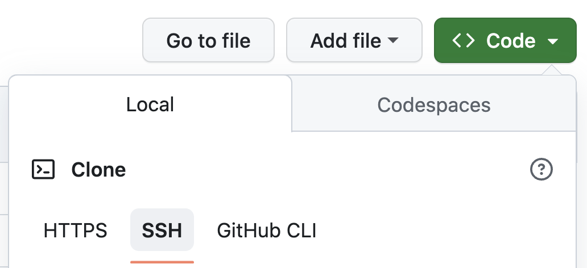

# GitHub Action

1. 產生 SSH KEY

```bash
ssh-keygen -t rsa -b 4096 -C "your_email@example.com"
```

為求方便，跳出的提出請全部按 Enter 快速略過

2. 將 SSH public key 加入 GitHub 帳號


```bash
cat ~/.ssh/id_rsa.pub
```

參考 https://docs.github.com/en/github-ae@latest/authentication/connecting-to-github-with-ssh/adding-a-new-ssh-key-to-your-github-account?tool=webui

將 SSH public key 加入

3. 請在自己的 GitHub 帳號底下建立一個 `cicd-pipeline-workshop` 的 Git Repo，並按照下面指示進行

**請設定為 Public 專案**

4. 請按照講師說明，建立以下兩個 GitHub Actions Secret
    - `DOCKER_USERNAME`
    - `DOCKER_PASSWORD`
    - `DOCKER_REGISTRY`

GitHub Actions Secret 詳細內容請見課程平台

5. 推送 Git

**請使用 SSH 方式 (git@xxxx) 方式，不要使用 HTTPS 方式 (https://github.xxxx)**



```
git remote -v
git remote remove origin
git remote add origin git@github.com:<你的帳號>/cicd-pipeline-practice.git
git push --set-upstream origin main
```

6. 推送完成後，檢視是否成功